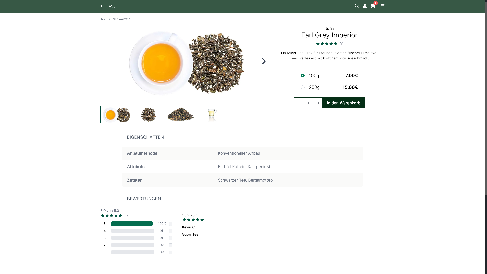
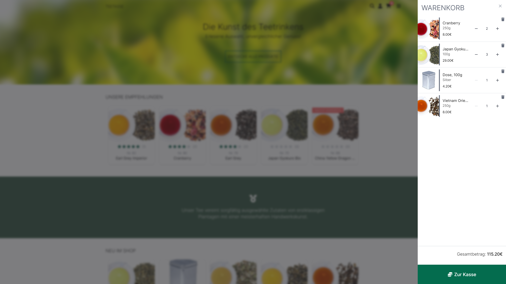
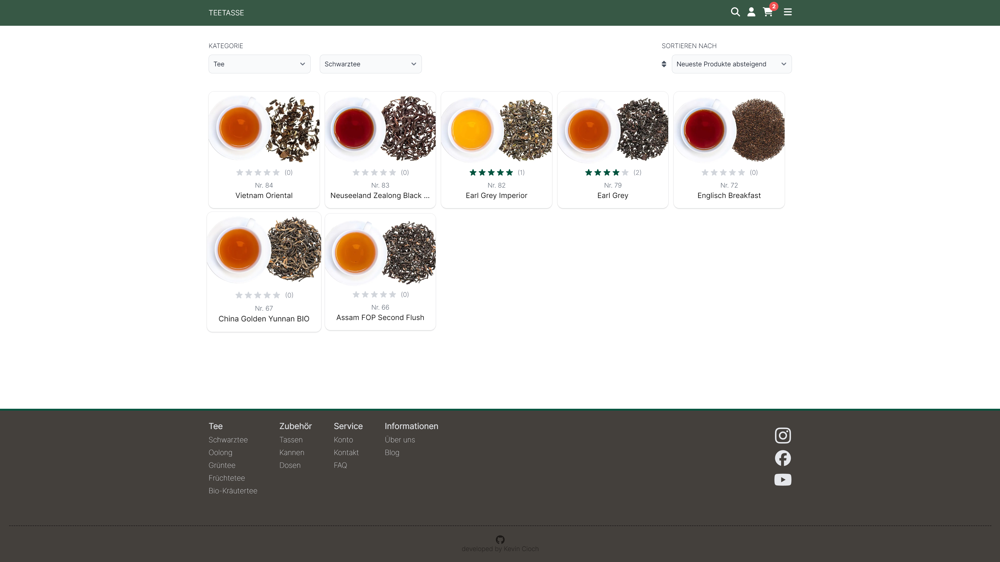
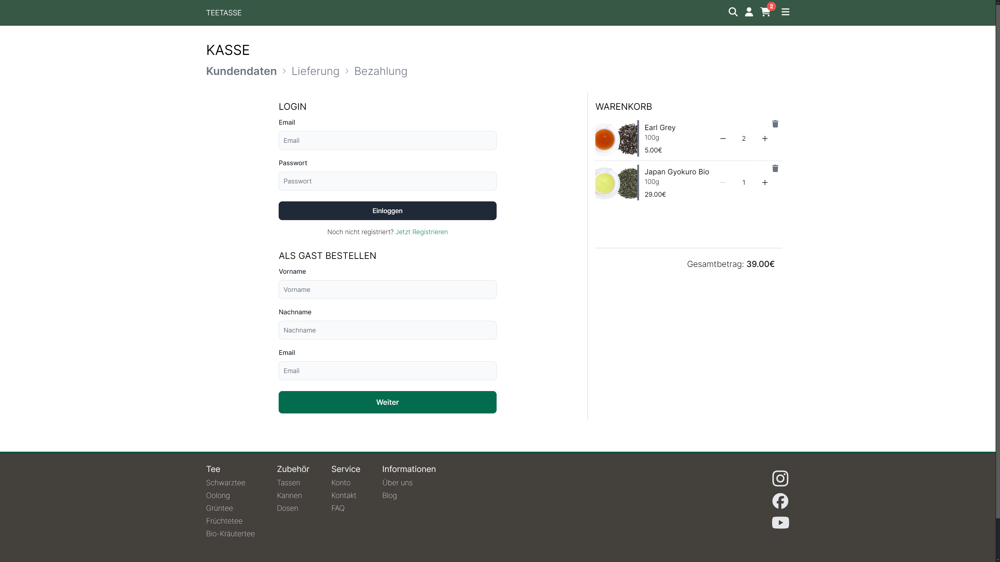
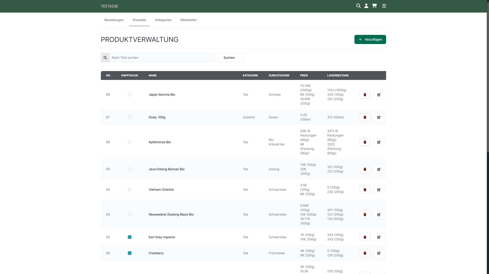
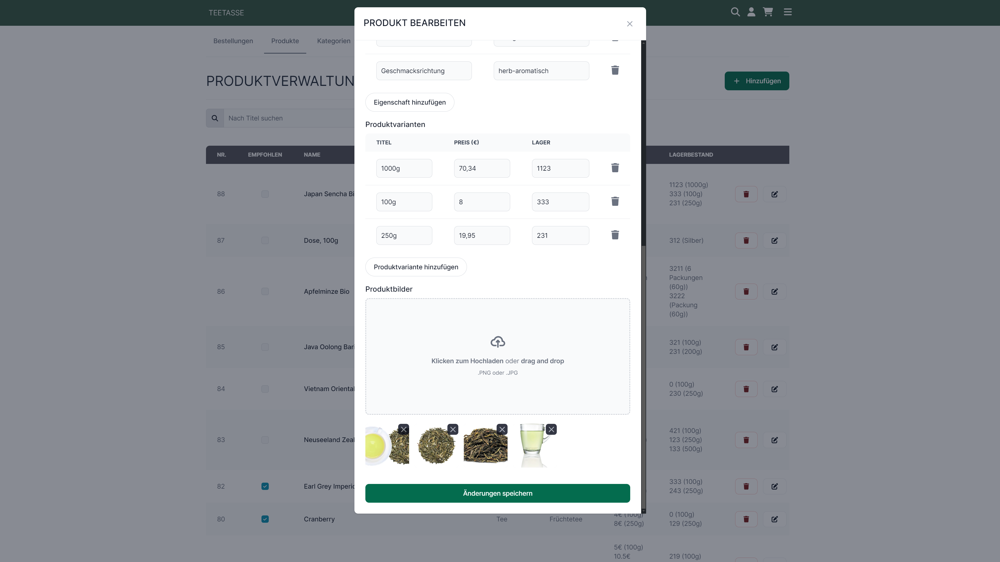
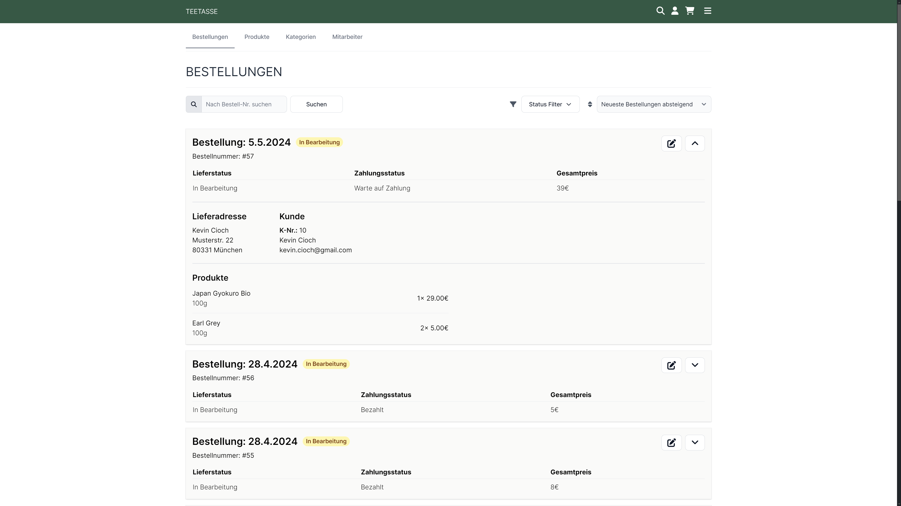

<h1 align="center">
  Teetasse 🍵
  <p style="font-style: italic ">A Next.js E-Commerce Platform For Tea Enthusiasts</p>
</h1>

`Teetasse` is an e-commerce platform to sell different types of tea and equipment. As a central part of my bachelor thesis, this fullstack web application showcases the implementation of SEO optimization techniques and the integration and comparison of different rendering methods (CSR / SSR / SSG). Its core functionalities include the authentication of users, searching & filtering for products, implementation of the order & payment process and management of products & categories. 

# Live Demo

You can see the application in action by checking out the [live demo](https://teetasse.kevincioch.com).

To try out the payment process you can use a payment method that redirects to a demo page to approve or disapprove the payment like Giropay or use the following demo credit card:

> <b>CARD-NR.:</b> 4242 4242 4242 4242
> <br /><b>EXPIRY DATE:</b> use a future date
> <br /><b>CHECK DIGIT:</b> 424

# Screenshots

<div align="center" style="display: flex; justify-content: center; flex-wrap: wrap; gap: 2em">
  
  
  
  
  
  
  
  
  
</div >

# Features

## Basic

- Authentication (NextAuth & JWT)
- Login & register
- Edit account information
- Responsive design
- SEO-optimized

## Customer

- Search & filter for products
- Cart functionality
- Create Reviews
- Buy products and payment process
- Order overview
- E-Mail confirmation

## Staff

- Manage products
- Manage categories
- Upload product images
- Edit recommended products
- Order overview
- Edit order status

## Admin

- Manage staff accounts

# Requirements

- NodeJS
- PostgresSQL Database
- Cloudinary API Key [(register here)](https://cloudinary.com/users/register_free)
- Stripe API Key [(register here)](https://dashboard.stripe.com/register)

# Setup

To setup the project follow the the next steps. It's important to create an `.env` file based on the required environment variables in `.env.sample` before running the application.

```bash
# 1. Clone repository
$ git clone https://github.com/kecioch/teetasse

# 2 Navigate into repository
$ cd teetasse

# 3 Install dependencies
$ npm i

# 4 Rename .env.sample to .env file and fill out the environment variables

# 5 Start in devmode
$ npm run dev

# 5.2 Start in buildmode
$ npm run build && npm run start
```

# Technologies

- [React](https://reactjs.org/)
- [Next.js](https://nextjs.org/)
- [Flowbite](https://flowbite.com/)
- [Tailwind](https://tailwindcss.com/)

# APIs

- [Stripe](https://stripe.com/)
- [Cloudinary](https://cloudinary.com/)
